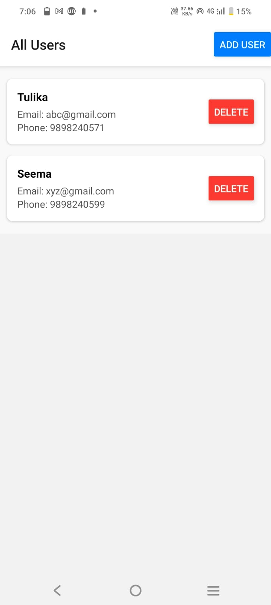
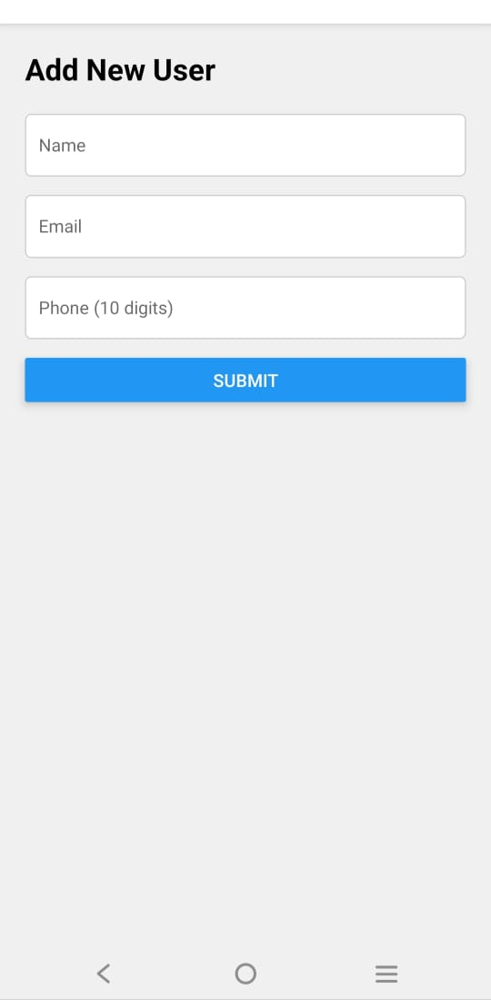
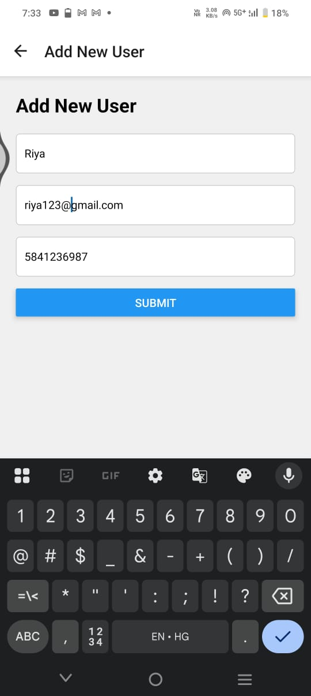
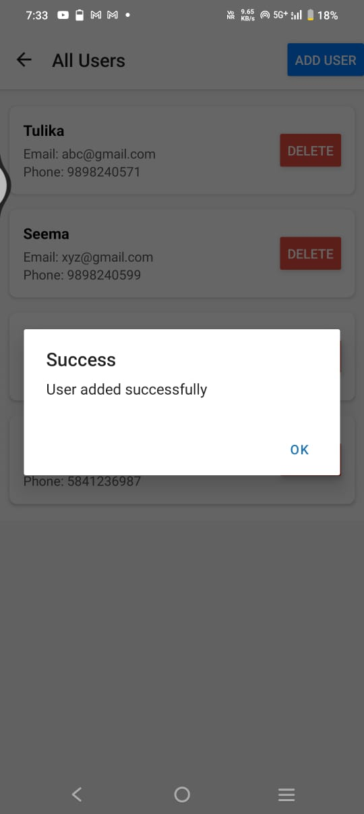
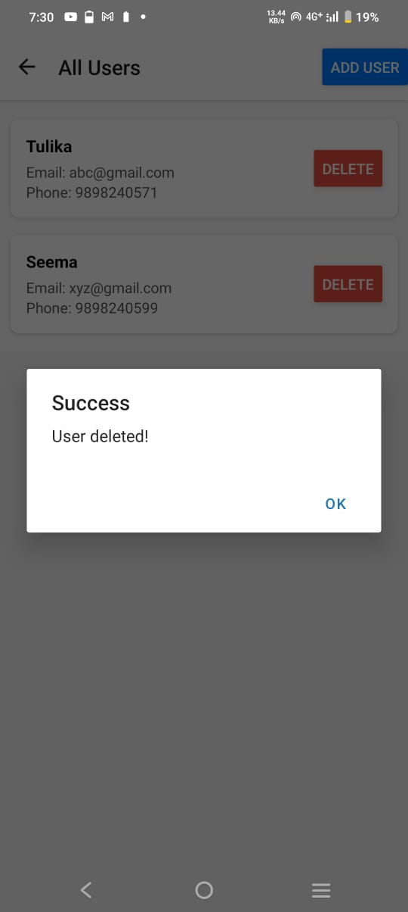
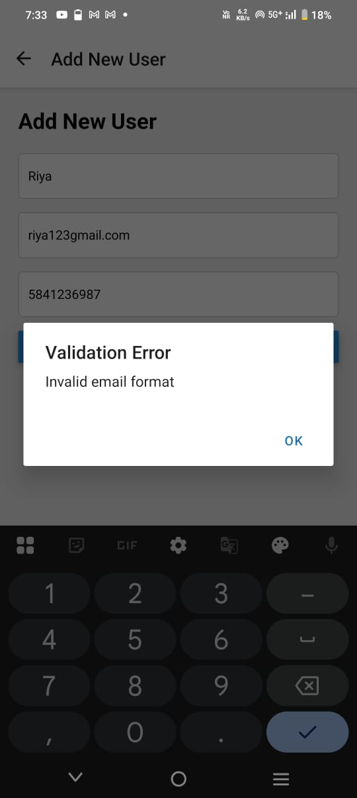
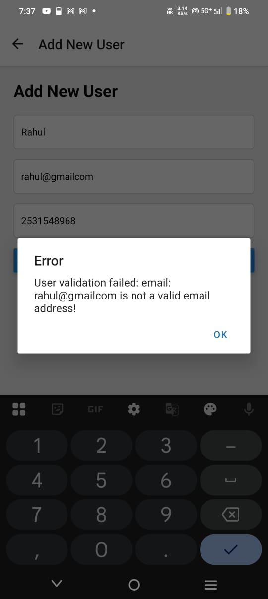

# 📚 Full-Stack User Management Documentation


---

## `backend-node`

This repository contains the Node.js/Express server and Mongoose models, providing a REST API for User CRUD operations.

### 1. Installation

This project requires **Node.js (v20+)** and a running instance of **MongoDB**.

```bash
# Clone the repository and navigate into the backend folder
git clone [YOUR-BACKEND-REPO-URL] backend-node
cd backend-node
```

# Install all dependencies
```bash
npm install
```


### 2. Environment Variables

Create a `.env` file in the root of the `backend-node` directory.  
**Do not commit this file to GitHub.**

| Variable    | Description                           | Example Value                           |
|------------|---------------------------------------|-----------------------------------------|
| MONGO_URI  | MongoDB connection string             | mongodb://localhost:27017/usermanager   |
| PORT       | Port on which the Express server runs | 5000                                    |

--- 
### 3. Running the Backend 
1. Ensure MongoDB is running (local or cloud). In this project I have used mongodb atlas.
2. Start the Express server.

```bash
npm start
```
```bash
http://localhost:5000/api
```

| Method | Endpoint         | Description             | Request Body (Example)                     |
| -----: | ---------------- | ----------------------- | ------------------------------------------ |
|    GET | `/api/users`     | Fetch all users         | —                                          |
|    GET | `/api/users/:id` | Fetch user by ID        | —                                          |
|   POST | `/api/users`     | Create a new user       | `{ "name": "", "email": "", "phone": "" }` |
| DELETE | `/api/users/:id` | Delete a user by ID     | —                                          |


## `frontend-react-native`

This repository contains the mobile application built using React Native and Expo, which consumes the backend REST API.

### 1. Installation

This project requires Node.js, Expo CLI, and the Expo Go mobile app or an emulator.
```bash
# Clone the repository and navigate into the frontend folder
git clone [YOUR-FRONTEND-REPO-URL] frontend-react-native
cd frontend-react-native

# Install dependencies
npm install

# Install validation library
npm install yup
```

 ### 2. Environment Configuration

Mobile apps cannot access localhost.
A tunneling service such as Ngrok is required for development.

Update the backend URL in src/config.js:
export const BASE_URL = 'https://abcd1234.ngrok-free.dev/api';

| File            | Variable   | Description                          |
| --------------- | ---------- | ------------------------------------ |
| `src/config.js` | `BASE_URL` | Public HTTPS URL of backend + `/api` |

⚠️ The Ngrok URL changes every time Ngrok restarts.


### 3. Running the Frontend

Follow these steps after the backend is running.

Step 1: Start Ngrok
```bash 
ngrok http 5000
```

Step 2: Update BASE_URL

Copy the HTTPS URL from Ngrok and update src/config.js.

Step 3: Start Expo
```bash
npm start
```

Step 4: Launch App

Scan the QR code using the Expo Go app on your mobile device.

### Notes:

Backend and frontend are independent repositories

Ngrok is required only during development

Production deployments should replace Ngrok with a hosted backend URL


### User View 



*User List Screen showing all users*


*Add new user*


*Adding new user*


*Success message or error message*


*Deleting a specific user*


*User List Screen showing all updated users*


### Part 5 :Bonus 
### Add basic validation on the Add User form (e.g., mandatory fields, simple email format check). 


*Deleting a specific user*


*User List Screen showing all updated users*

